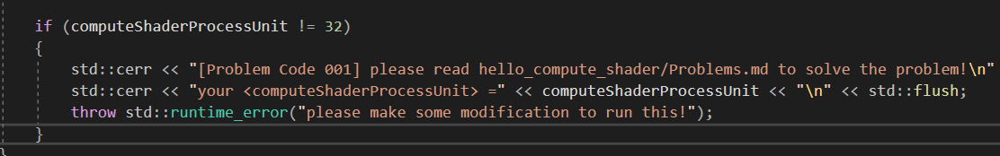

# Problems

这里汇总了所有可能出现的问题，并给出相应的解决方案。

## P001

### 原因

由于你的GPU最大任务组（maxComputeWorkGroupInvocations）小于1024，所以无法使用32x32。

```shell
[Problem Code 001] please read hello_compute_shader/Problems.md to solve the problem!
your <computeShaderProcessUnit> = xxx
please make some modification to run this!
```

### 解决方案

将`\hello_compute_shader\shader\ray_tracing\ray_tracing_basic.comp`中

```glsl
const int blockSizeX = 32;
const int blockSizeY = 32;
layout (local_size_x = blockSizeX, local_size_y = blockSizeY) in;
```

改为：

```glsl
const int blockSizeX = <computeShaderProcessUnit>;
const int blockSizeY = <computeShaderProcessUnit>;
layout (local_size_x = blockSizeX, local_size_y = blockSizeY) in;
```

双击重新编译。

删去此段代码

重新运行。
